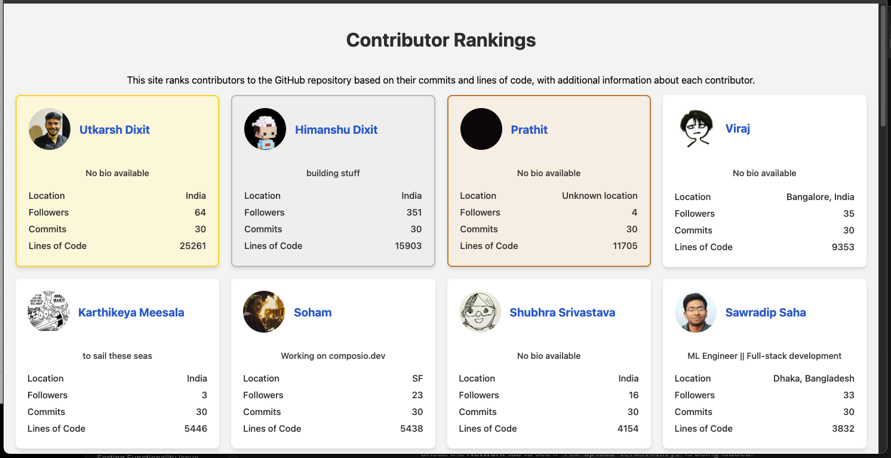

# Example - GitHub Contributor Rankings for ComposioHQ

This project has been configured to rank contributors to the [ComposioHQ/composio](https://github.com/ComposioHQ/composio) repository. Below is a live example of how the project fetches data from the GitHub API and ranks contributors based on their number of commits and lines of code.

## Repository:
- **Owner:** ComposioHQ
- **Repository:** Composio

## Screenshot

Here is a screenshot of the working project:



## Setup Configuration

To set up this project, we configured the `_config.yml` file to point to the following repository:

```yaml
json:
  - name: contributors
    src: "https://api.github.com/repos/ComposioHQ/composio/contributors" # Also added this in `fetch_contribution_data.rb` file.
    headers:
      Authorization: "token {{ site.github_token }}"
```

With this configuration, the project fetches data from the GitHub API, processes the contributors' commit counts, and calculates the total lines of code contributed.

## Results

The top contributors are displayed in a responsive, material-design inspired card layout with gold, silver, and bronze highlights for the top three contributors. Each card contains:
- Contributor's **avatar**.
- **Name** and a link to the GitHub profile.
- **Bio**, **location**, and **followers**.
- Number of **commits** and **lines of code** contributed.
